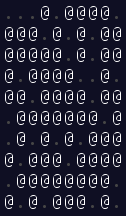

## Animations

Some animated GIFs for Grid-based puzzles.

### Year 2025, Day 7 - Laboratories, Part 1

The animation shows a recursive algorithm calculating the path of a tachyon beam moving downwards, being split by
different splitters until it exits the tachyon manifold at the bottom.

### Year 2025, Day 4 - Printing Department, Part 2

Iteratively, all accessible rolls of paper (those with fewer than four rolls of paper in their eight adjacent positions)
are removed by a forklift.

